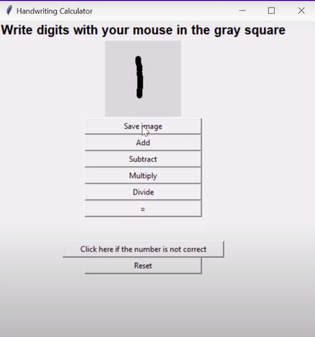

# Natural-Calculator-with-Digit-Prognosis

A Handy Calculator in which the user doesn't have to type the numbers, but instead only draw the number, and the machine will be able to fetch the correct number and perform the required arithmetic operations.

<h2>About:-</h1>

  The handwritten digit recognition is the ability of computers to recognize human handwritten digits. It is a hard task for the machine because handwritten digits are not perfect and can be made with many different flavors. 

 Handwritten digit recognition is the solution to this problem which uses he image of a digit and recognizes the digit present in the image and since the written information has a high probability of being captured incorrectly on the system we need it on anyway.

  

The MNIST handwritten digit classification problem is a standard data-set used in computer vision and deep learning. Although the data-set is effectively solved, it is used as the basis for learning and practicing how to evelop, evaluate, and use convolutional deep learning neural networks for image classification.

<h2> GUI </h2>

<h2>Explanation Of Model</h2>

  A simple convolutional neural network is a sequence of layers, and every layer transforms one volume of activations to another through a differentiable function. We use three main types of layers to build the network. These are convolutional layers, pooling layers and fully connected layers. We will stack these layers to form our network architecture. We will go into more details below.

<h2>Architecture of Model</h2>

Layer-1 Consists of a convolutional layer with ReLu (Rectified Linear Unit) activation function.
It is the first convolutional layer of our CNN architecture. This layer gets the pre-processed image
as the input of size n*n=28*28. The convolution filter size (f*f) is 5*5; padding (p) is SAME,
stride (s) is 1 and the number of filters is 32. Then the ReLu activation is done in each feature map.

Layer-2 It is the max pooling layer. This layer gets the input of size 32*28*28 from the previous
layer. The pooling size is 2*2; padding is SAME and stride is 1. After this max pooling operation,
we get feature maps of size 32@14*14. Max pooling is done in each feature map independently, so
we get same number feature maps as the previous layer. This layer has no activation function.

Layer-3 It is the second convolutional layer with ReLu activation function. This layer gets the
input of size 32@14*14 from the previous layer. The filter size is 5*5; padding is SAME, the
stride is 1 and the number of filters is 64. After this convolution operation, we get feature maps of
size 64*14*14. Then ReLu activation is done in each feature map.

Layer-4 It is the second max pooling layer. This layer gets the input of size 64*14*14 from the
previous layer. The pooling size is 2*2; padding is same and stride is 1. After this max pooling
operation, we get a feature map of size 7*7*64

Layer-5 It is the dropout layer is used to deactivate some of the neurons and while training, it
reduces offer fitting of the model.

Layer-6 It is flattening the output obtained from layer 5 and this flatten output is passed to layer 7.

  
Layer-7 It is the hidden layer of neural network containng 1024 neurons having sigmoid
activation fn.

Layer-8 It is the last layer of the network. It is also fully connected layer. This layer will
compute the class scores, resulting in a vector of size 10, where each of the ten numbers
corresponds to a class score, such as among the ten categories of MNIST dataset. It has softmax
activation function for final outputs.

